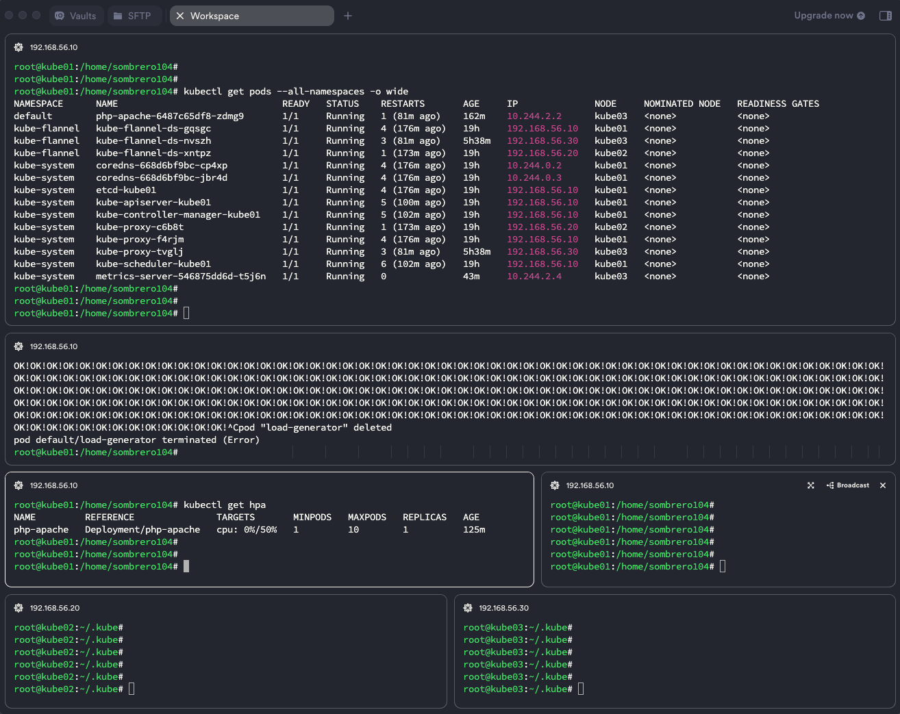

 

# HPA 오토스케일러 테스트
 

## HPA (HorizontalPodAutoscaler)
워크로드의 크기를 수요에 맞게 자동으로 스케일링한다.  
수평 스케일링(HPA, HorizontalPodAutoscaler)은 부하 증가에 대해 파드를 더 배치하는 것을 뜻한다.  
이는 수직 스케일링(VPA, VerticalPodAutoscaler) 과는 다른데,  
쿠버네티스에서 수직 스케일링은 이미 실행 중인 파드에 더 많은 리소스(메모리/CPU)를 할당하는 것을 뜻한다.  
  

### 샘플 애플리케이션 서비스 생성 
부하를 증가시키기 위한 샘플 애플리케이션의 파드를 생성한다.  
~~~
kubectl apply -f https://k8s.io/examples/application/php-apache.yaml
~~~
 

### 모든 파드 상태 확인 
파드 상태를 지켜보기 위해 아래 명령을 실행한 프롬프트를 띄워놓는다.  
~~~
kubectl get pods --all-namespaces -o wide 
~~~
 

### HPA 오토스케일러 생성 
위에서 생성한 샘플 애플리케이션에 대한 오토스케일러를 생성한다.  
~~~
kubectl autoscale deployment php-apache --cpu-percent=50 --min=1 --max=10
~~~
 

### HPA 오토스케일러 상태 확인
아래 명령으로 파드가 얼마나 증가하고 감소하는지 현재의 오토스케일링 상태를 확인할 수 있다.  
~~~
kubectl get hpa 

kubectl get hpa php-apache --watch
~~~
 

### 서비스 요청 무한 루프 실행 (부하 증가)
아래 명령으로 샘플 애플리케이션에 무한 루프로 쿼리를 실행하여 부하를 증가 시킨 후 파드의 증가/감소 상태를 확인 한다.  
~~~
kubectl run -i --tty load-generator --rm --image=busybox:1.28 --restart=Never -- /bin/sh -c "while sleep 0.01; do wget -q -O- http://php-apache; done"
~~~
 

### 실행 화면 
 
  

#### [참조] 

https://kubernetes.io/ko/docs/tasks/run-application/horizontal-pod-autoscale/  

https://kubernetes.io/ko/docs/tasks/run-application/horizontal-pod-autoscale-walkthrough/  

   

